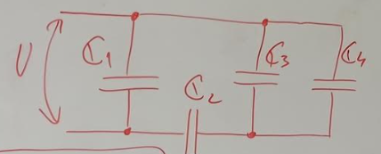
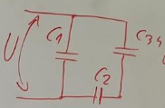
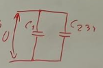

# **Kondenzátorok energiája**

Kondenzátorok energiája

https://karpad2.github.io/condensator_energy

---

# Kondenzátorok kötése
Párhuzamos 
$C_e=C_1+C_2$
És amennyiben Párhuzamos akkor a Feszültségek egyenlőek az adott sémán:
pl.
${U_1=U_2=U_3}$
Ammenyiben soros kötésünk van akkor töltés eloszlása az egyforma és ezért:
 $\frac{1}{C_e}=\frac{1}{C_1}+\frac{1}{C_2}$
$Q_1=Q_2=Q_3$

---

# Különböző kombinációji a képleteknek

${Q=C*U}$
${U=\frac{C}{Q}}$


---

# Kondenzátorok energiája

```
A kondenzátorban az energia a dielektrikumban tárolódik, melynek értéke
```

$W_c=\frac{1}{2}QU$
$W_c=\frac{1}{2}CU^2$
$W_c=\frac{1}{2} \frac{Q^2}{C}$

---


$C_1=10 nF$
$C_2=20 nF$
$C_3=30 nF$
$C_4=40 nF$
$U=50V$


---

$C_{34}=C_3+C_4$
$C_{34}= 70nF$

---


$C_{234}=\frac{C_2C_{34}}{C_2+C_{34}}$
$C_{234}= \frac{20*70}{20+70}$
$C_{234}=15.556 nF$

---

$C_e=C_1+C_{234}$
$C_e=10nF+15.56nF=25.56nF$

---

Mivel megvan a $C_e$ és innen visszafelé kitudjuk számolni az alapértékeket.
Ez párhuzamos kötés és innen tudjuk a következő feltételeket.
$U_e=U_1=U_{234}$

$Q=CU$
alapján
$Q_1=C_1*U=10nF* 50V = 500 n C$
$Q_{234}=C_{234}*U$
$Q_{234}=15.56nF* 50V = 778 n C$


---


Ennél a lépésnél soros kötésünk van ezért: 
$Q_{234}=Q_2=Q_{34}$
Innen tovább => 
- $U_2=\frac{Q_2}{C_2}=\frac{778 n C}{20n F}=38.9 V$
- $U_{34}= \frac{Q_{34}}{C_{34}}=\frac{778 n C}{70 nF}=11.14 V$

---

Ennél a lépésnél párhuzamos kötésünk van ezért: 
$U_{34}=U_3=U_4$
$Q_3=U_3*C_3=11.14V * 30nF$
$Q_3=334.2n C$

$Q_4=U_4*C_4=11.14V * 30nF$
$Q_4=445.6 n C$

---

Megvannak az eredmények innen:
$W_{C_1}=\frac{Q_1*U_1}{2}=\frac{500nC*50V}{2}=12.5*10^{-6}J$
$W_{C_2}=\frac{Q_2*U_2}{2}=\frac{778nC*38.9V}{2}=15.132*10^{-6}J$
$W_{C_3}=\frac{Q_3*U_3}{2}=\frac{334.2nC*11.4V}{2}=1.904*10^{-6}J$
$W_{C_4}=\frac{Q_4*U_4}{2}=\frac{445.6nC*11.4V}{2}=2.5399*10^{-6}J$

# Ellenőrzés
${Q_e}=C_e*U=1.27*10^{-6}C$
$W_{C_e}=\frac{Q_e*U}{2}=\frac{1.27*10^{-6}C*50V}{2}=31.75*10^{-6}J$
$W_{C_e}=W_{C_1}+W_{C_2}+W_{C_3}+W_{C_4}+W_{C_5}=32.076*10^{-6}J$